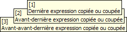
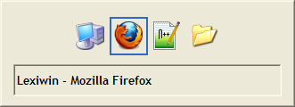
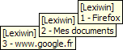

Lexiwin vous apporte les fonctionnalités que vous avez toujours souhaitées sous Windows sans jamais oser les demander !

## Parmi lesquelles

- Le copier-coller sans mise en forme : faites Ctrl + Alt + V pour coller proprement un texte.
- La mémorisation des derniers éléments copiés : faites Ctrl + Espace pour y accéder.
- Le changement de fenêtre facile : clic droit + tournez la molette de la souris au lieu de Alt + Tab.
- Lorsque vous utilisez la molette de la souris, le signal de défilement est envoyé à la fenêtre se trouvant sous le pointeur de la souris, même si ce n'est pas la fenêtre active.
- Ouvrez facilement vos applications, adresses, fichiers, et dossiers favoris avec la touche VerrMaj.

---

Ctrl + Espace

---

Clic droit + Tourner la molette vers le haut/bas

---

VerrMaj + Molette

---

## Et bien d'autres encore

- Le gestionnaire de presse-papiers vous permet :
  - d'accéder aux derniers éléments que vous avez copiés ou coupés (textes, images, fichiers, etc.),
  - de coller les éléments de type texte avec ou sans mise en forme (gras, italique, souligné, liens hypertextes, etc.),
  - de coller les éléments dans l'ordre de leur copie,
  - de mémoriser des éléments souvent utilisés dans dix registres fixes.
- Le gestionnaire de fenêtres vous permet :
  - de fermer, réduire, agrandir, et changer d'écran les fenêtres facilement et rapidement avec le clavier ou la souris,
  - d'agir avec la souris sur des fenêtres qui ne sont pas actives : faire défiler le contenu, fermer, réduire, etc.,
  - d'ouvrir et de naviguer rapidement dans le menu de sélection de fenêtre avec la souris,
  - de sauvegarder et de restaurer la taille et la position de vos fenêtres favorites.
- Le lancement rapide vous permet :
  - d'afficher un menu pour ouvrir vos fichiers et emplacements favoris rapidement,
  - d'utiliser des raccourcis pour les ouvrir sans même afficher le menu.
- Divers raccourcis vous permettent :
  - de contrôler la lecture multimédia (lecture, pause, suivant, modifier le volume, etc.),
  - d'utiliser plus ergonomiquement les touches d'édition (les quatre flèches, Début, Fin, Retour, etc.)

## Documentation

Pour apprendre à utiliser Lexiwin, consulter [l'aide complète](./UserManual-Fr.md) et la [fiche de référence](./QuickReference-Fr.md).
